# 💎GNU Screenコマンドをつかってみる

GNUの`screen`コマンドは1つの端末上に、仮想端末を使い端末を多重化できる[ターミナルマルチプレクサ](https://en.wikipedia.org/wiki/Terminal_multiplexer)と呼ばれるソフトウェアです。

`screen`コマンドは仮想端末を提供し、ユーザは仮想端末や提供されるWindowを逐次切り替えて操作する事ができます。

なので下記のような事が実現できます。

- 作業途中で仮想端末を抜けて、後で再接続して処理を継続したり。
- 1つの仮想端末で長時間動くようなタスクをバックグラウンドで動かしつつ、別の仮想端末につないで他の処理を継続したり。
- 仮想端末上で処理を実行しておいて、一旦ユーザログオフしたとしても仮想端末上で処理は継続され、後でユーザログインして仮想端末に接続すれば処理を継続できたり。
- sshで端末接続した際に、仮想端末上で処理しておけばssh接続が切れてしまっても、再接続すれば処理を継続できたり。
- 複数のユーザで仮想端末を共有したり。

etcetc......

本資料はそんな`screen`コマンドの基本的な使い方となります。

## 公式サイト

[GNU Screen](https://www.gnu.org/software/screen/)

## 利用バージョンの確認

まずは利用する`screen`コマンドのバージョンを確認します。
バーションの確認は`--version`オプションをつけて確認できます。

```sh
screen --version
```

なお`screen`コマンドはディストリビューションによってはデフォルトでインストールされている事があります。
インストールされていない場合は、各ディストリビューションのパッケージマネージャから適宜インストールして下さい。

本資料で利用している環境のバージョンは `Screen version 4.06.02 (GNU) 23-Oct-17` になります。

## ユーザマニュアルについて

本資料では`screen`コマンドの基本的な使い方を説明していますが。
本コマンドは出来ることが多いコマンドのため、細かい利用方法は公式ユーザマニュアルをチェックして下さい。

[Screen User’s Manual](https://www.gnu.org/software/screen/manual/screen.html)

もしくは`man screen`も詳しく記載されているのでこちらも参照するとといいかもしれません。

## スクリーンセッションの開始

`screen`コマンドではスクリーンセッションというものを作成し、それをアタッチしたりデタッチして切り替えることにより。
バックグラウンドで別の処理を流したり、必要なった画面を表示したり作業ができます。

スクリーンセッションを開始するのに下記のように`screen`コマンドを実行する。

```sh
screen
```

下記のようにスタートアップメッセージが出てきた場合はエンターを押して次の画面。

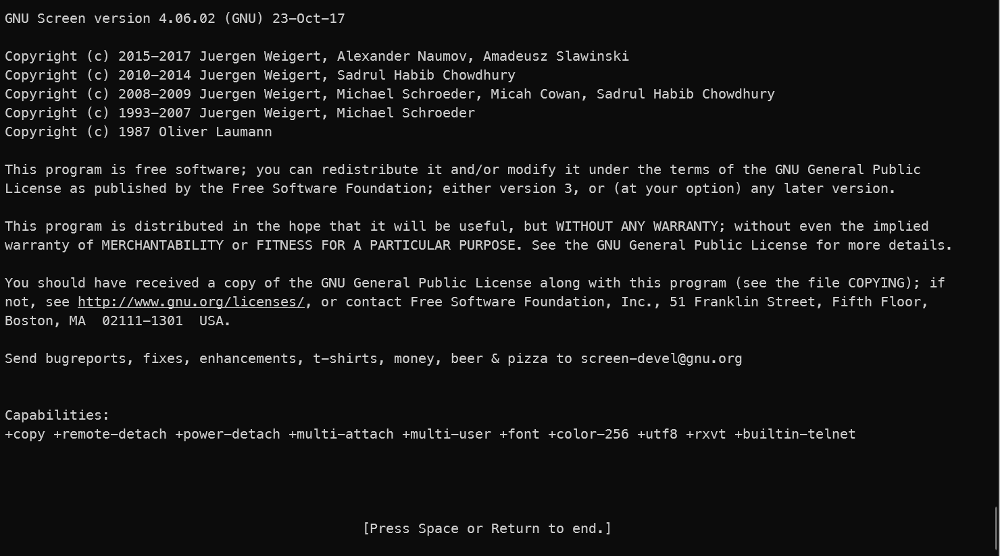

`screen`コマンドを実行すると、スクリーンセッションを生成し、そこにWindowが作成され、そのWindowの上でシェルが実行されています。

### 余談：WSL環境の場合

2020年12月現在、WindowsのWSL環境（ubuntu）で`screen`コマンド実行時に`Cannot make directory '/run/screen': Permission denied`とエラーが出る場合。
どうやら`sudo /etc/init.d/screen-cleanup start`を実行すればいいようです。（下記参照）

[Running “screen” without additional permissions on WSL](https://stackoverflow.com/questions/45517515/running-screen-without-additional-permissions-on-wsl)

## 操作について

`screen`コマンドでは接続したスクリーンセッション上で　制御コード `Ctrl+A` を押した後に　`対応するキー`　を押して各種操作を実行します。
新しいWindowを生成する場合は `CTRL+A` を押した後に　`c`　を押すといった具合。

なお各種キー操作にはスクリーンコマンドも用意されており、キー操作以外でもこちらを利用しても操作することも出来る。

接続しているスクリーンセッションに対してスクリーンコマンドを実行する方法としては。

`screen -x コマンド`　のように実行するか。
`CTRL+A :`でコマンドラインモードに入りコマンドを実行すればOK。

## キーバインドを確認してみる

[Help](https://www.gnu.org/software/screen/manual/screen.html#Help)

- `CTRL+A ?`
- `help`

スクリーンセッションに接続した状態で、`CTRL+A ?`のキー操作でキーバインドを確認できるので確認してみます。

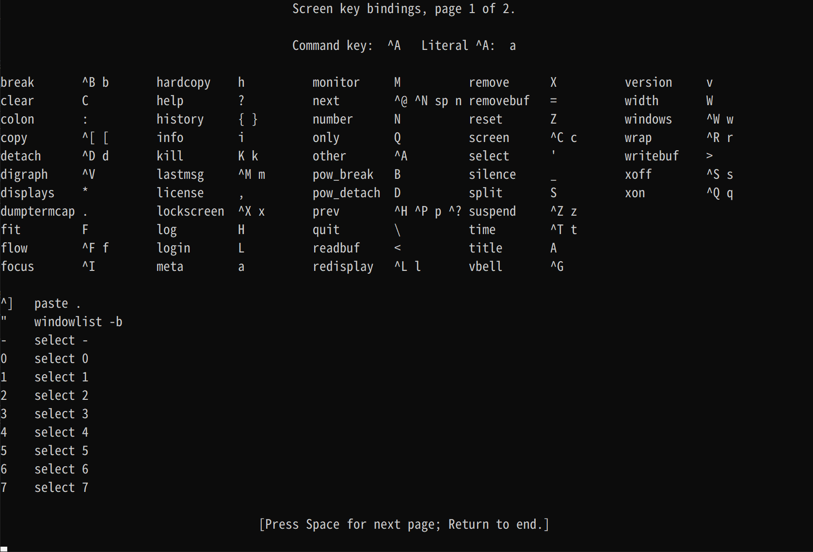

スクリーンコマンドで実行する場合は

`CTRL+A :`でコマンドラインモードに入り　`help`　で実行。
もしくは`screen -X help`を実行。

## スクリーンセッションの一覧を確認してみる

[Invoking Screen](https://www.gnu.org/software/screen/manual/screen.html#Invoking-Screen)

- `screen -ls`

`screen -ls`でスクリーンセッション一覧が確認できるので確認してみます。

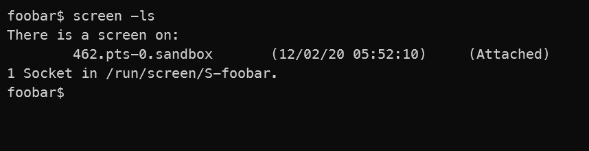

現在、462.pts-0.sandboxというスクリーンセッションがアタッチされている事が確認できます。

## 現在割り当てられているスクリーンセッションを確認する

[Session Name](https://www.gnu.org/software/screen/manual/screen.html#Session-Name)

- `Command:sessionname`

スクリーンセッションに接続した状態で、`sessionname`コマンドを実行すると現在割当られているスクリーンセッション名を確認できます。

スクリーンコマンドで実行する場合

`CTRL+A :`でコマンドラインモードに入り　`sessionname`　で実行。
もしくは`screen -X sessionname` で実行。

このコマンドは引数を与えるとセッション名の変更を行えます。
※ただしセッション名を変更しても環境変数`$STY`に反映されなかったり色々とあるようなので注意が必要です。

## スクリーンをデタッチ・アタッチしてみる

[Detach](https://www.gnu.org/software/screen/manual/screen.html#Detach)

- `CTRL+ d`
- `CTRL+A CTRL+D`
- `Command:detach`

現在アタッチされているスクリーンセッションから抜ける場合は`CTRL+A d` もしくは`CTRL+A CTRL+D`で抜けられます。
コマンドの場合は`detach`。

デタッチした後に、`screen -ls`を実行した画面が下記。

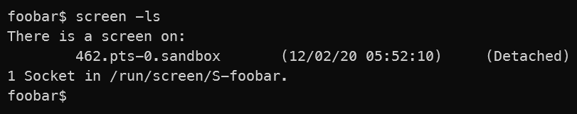

`screen -ls`で先程までアタッチされていた462がデタッチされている事を確認できます。
スクリーンセッションから抜けているので、当たり前ですが`CTRL+A ?`等の`screen`コマンドのキーバインドは使えない状態です。

デタッチして抜けたセッションに接続するには`-r [pid.sessionname]`でアタッチできます。

上記の場合は`screen -r 462.pts-0.sandbox`と実行すればOK。
ただし完全に指定しなくても一意にマッチすればいいようで、`screen -r 462`でも接続できます。

さらに言えばセッションが単一だけの場合では、`screen -r`だけで実行してもセッションに接続できます。

スクリーンコマンドで実行する場合は

`CTRL+A :`でコマンドラインモードに入り　`detach`　で実行。
もしくは`screen -X detach`を実行。

## スクリーンセッションに名前をつけて開始する

[Invoking Screen](https://www.gnu.org/software/screen/manual/screen.html#Invoking-Screen)

- `screen -S`

`screen -S`でスクリーンセッションに名前をつけて開始できます。
下記コマンドでhogehogeという名前をつけて開始してみます。

```sh
screen -S hogehoge
```


`screen -ls`でhogehogeと名前のつけられた491.hogehogeというセッションが開始されアタッチされている事が確認できます。

## スクリーンセッションを生成時にセッションをアタッチせずに開始する（デタッチモード）

[Invoking Screen](https://www.gnu.org/software/screen/manual/screen.html#Invoking-Screen)

- `screen -d -m`
- `screen -d -m -S [sessionname]`

`screen -d -m`でスクリーンセッションを生成しますがアタッチせずにスクリーンセッションを生成します。
また`-S`オプションを利用して`screen -d -m -S hogehoge`で名前付きデタッチモードのスクリーンセッションを生成できます。

スクリーンセッション名を一意になるように名付ければ。

`screen -r hogehoge` というようにスクリーンセッション名だけで接続できるので管理が便利になります。

### 余談：すでにアタッチされているセッションに接続する場合

色々と操作していてアタッチしたままの状態になって残ってしまったセッションがある場合。
`screen -r`で接続しようとしても、下記のように再接続できるscreenがないとメッセージが出ます。

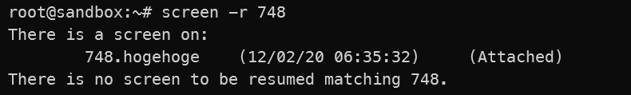

このようなケースでは`screen -d -r　[pid.sessionname]`のように実行すると適宜、デタッチしてアタッチしてくれます。

## スクリーンセッションを閉じる

[Quit](https://www.gnu.org/software/screen/manual/screen.html#Quit)

- `CTRL+A \`
- `Command:quit`

スクリーンセッションに接続している状態で`CTRL+A \`を実行するとセッションを閉じる事ができます。

キー操作を行うと確認プロンプトがでるのでy。

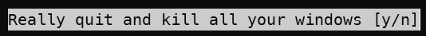

スクリーンコマンドで実行する場合は

`CTRL+A :`でコマンドラインモードに入り　`quit`　で実行。
もしくは`screen -X quit`を実行。

## Windowを生成してみる

[Screen Command](https://www.gnu.org/software/screen/manual/screen.html#Screen-Command)

- `CTRL+A c`
- `CTRL+A CTRL+c`
- `Command:screen`

ここまではスクリーンセッションを複数作って画面管理を行ってきましたが。
スクリーンセッションの中に複数のWindowを作る事が可能です。

新しいWindowを生成する場合は、スクリーンセッションに接続した状態で

`CTRL+A c` もしくは `CTRL+a CTRC+c`で新しいWindowを生成します。

スクリーンコマンドで実行する場合は

`CTRL+A :`でコマンドラインモードに入り　`screen`　で実行。
もしくは`screen -X screen`を実行。

## 生成されたWindowの一覧を確認する

[Selecting a Window](https://www.gnu.org/software/screen/manual/screen.html#Selecting)

- `CTRL+A "`
- `Command:windowlist -b`

`CTRL+A "`で生成されているWindowの一覧を確認できます。
またここでWindowの移動も出来ます。

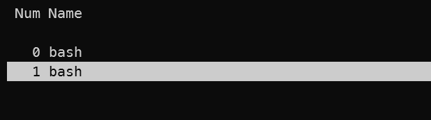

スクリーンコマンドで実行する場合は

`CTRL+A :`でコマンドラインモードに入り　`windowlist -b`　で実行。
もしくは`screen -X windowlist -b`を実行。

## 次のWindowへ移動

[Selecting a Window](https://www.gnu.org/software/screen/manual/screen.html#Selecting)

- `CTRL+A space`
- `CTRL+A n`
- `CTRL+A CTRL+n`
- `Command:next`

Window listを表示してそこでWindow間の移動ができましたが、上記のコマンドでも移動できます。

スクリーンコマンドで実行する場合は

`CTRL+A :`でコマンドラインモードに入り　`next`　で実行。
もしくは`screen -X next`を実行。

## 前のWindowへ移動

[Selecting a Window](https://www.gnu.org/software/screen/manual/screen.html#Selecting)

逆順に移動する場合は下記

- `CTRL+A p`
- `CTRL+A CTRL+p`
- `CTRL+A CTRL+h`
- `CTRL+A BackSpace`
- `Command:prev`

スクリーンコマンドで実行する場合は

`CTRL+A :`でコマンドラインモードに入り　`prev`　で実行。
もしくは`screen -X prev`を実行。

## Windowにタイトルをつける

[Naming Windows (Titles)](https://www.gnu.org/software/screen/manual/screen.html#Naming-Windows)

- `CTRL+A A`
- `Command:title`

Windowが多くなってくると、どこで何をやっている画面なのか判別しづらくなってきます。
そんな場合はWindowにタイトルをつける事ができるので、名前をつけることにより識別しやすくなります。

タイトルは`CTRL+A A`で設定する。

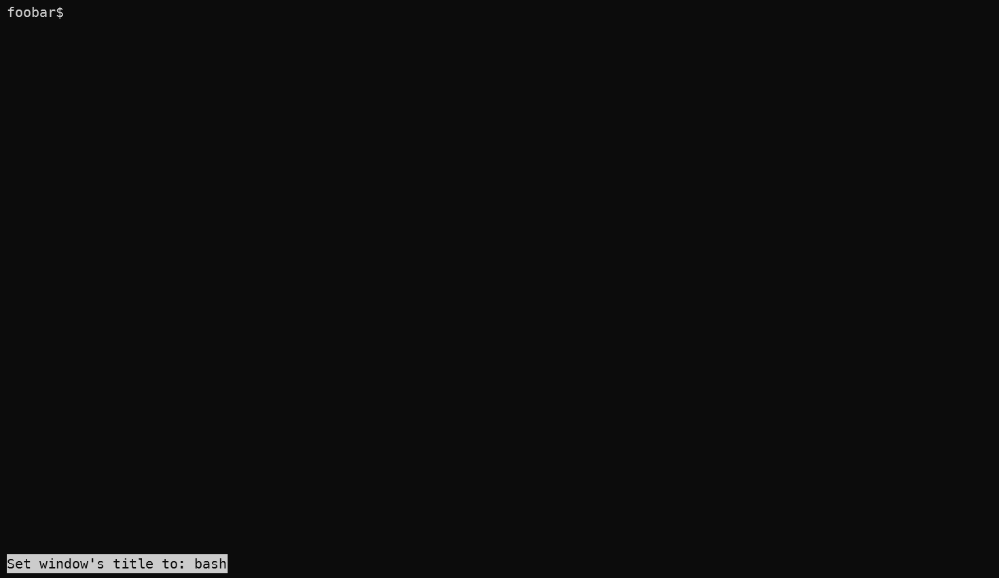

コマンドを入力すると`set window's title to:`と出てくるので、ここで現在のタイトルから変更する事ができます。

Windows Listでも下記のように変更されている事が確認できます。これでわかりやすい。

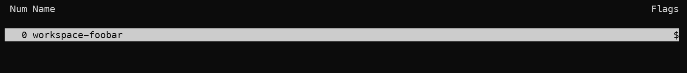

スクリーンコマンドで実行する場合は

`CTRL+A :`でコマンドラインモードに入り　`title [window title]`　で実行。
もしくは`screen -X title [window title]`を実行。

## 現在開いているWindowを確認する

[Number](https://www.gnu.org/software/screen/manual/screen.html#Number)

- `CTRL+A N`
- `Command:number`

現在、どのWindowを開いてるかは、`CTRL+A N`で確認できます。

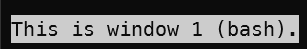

スクリーンコマンドで実行する場合は

`CTRL+A :`でコマンドラインモードに入り　`number`　で実行。
もしくは`screen -X number`を実行。

## 現在開いているWindowを閉じる

[kill](https://www.gnu.org/software/screen/manual/screen.html#Kill)

- `CTRL+A k`
- `CTRL+A K`
- `Command:kill`

スクリーンセッションに接続している状態でキー操作`CTRL+A K`　もしくは `CTRL+A k` でWindowを閉じる。

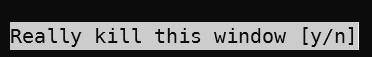

確認メッセージが出てくるので、`y`を入力して閉じる事ができます。
複数のWindowと開いている場合はWindowが閉じられて、他のWindowに移動します。
開いているWindowが1つの場合は、スクリーンセッションが閉じらます。

なお`exit`や`CTRL+D`を送信しても同様に現在のWindowを閉じることができます。

スクリーンコマンドで実行する場合は

`CTRL+A :`でコマンドラインモードに入り　`kill`　で実行。
もしくは`screen -X kill`を実行。

## 画面を分割する

[Split](https://www.gnu.org/software/screen/manual/screen.html#Split)

横分割

- `CTRL+A S`
- `Command:split`

縦分割

- `CTRL+A |`
- `Command:split -v`

先にWindowの話をしてしまいましたが、スクリーンセッションにはRegionと呼ばれる領域があり。
Regionを分割して、分割したRegionにWindowを割り当てることにより画面を分割します。

[Region](https://www.gnu.org/software/screen/manual/screen.html#Regions)

スクリーンセッションに接続している状態でキー操作`CTRL+A S`を実行して画面を横に分割できます。
※縦に分割する場合は`CTRL+A |`

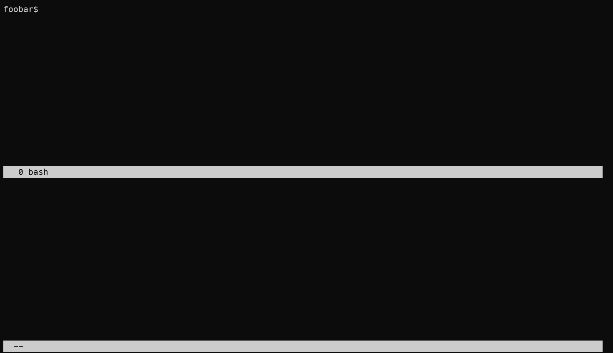

スクリーンコマンドで実行する場合は

`CTRL+A :`でコマンドラインモードに入り　`split`　で実行。
もしくは`screen -X split`を実行。
※縦分割の場合は`split v`

## 分割された画面の移動

[Focus](https://www.gnu.org/software/screen/manual/screen.html#Focus)

- `CTRL+A TAB`
- `Command:focus`

スクリーンセッションに接続している状態で`CTRL+A TAB`を実行してフォーカスを分割された次のリージョンに移動できます。

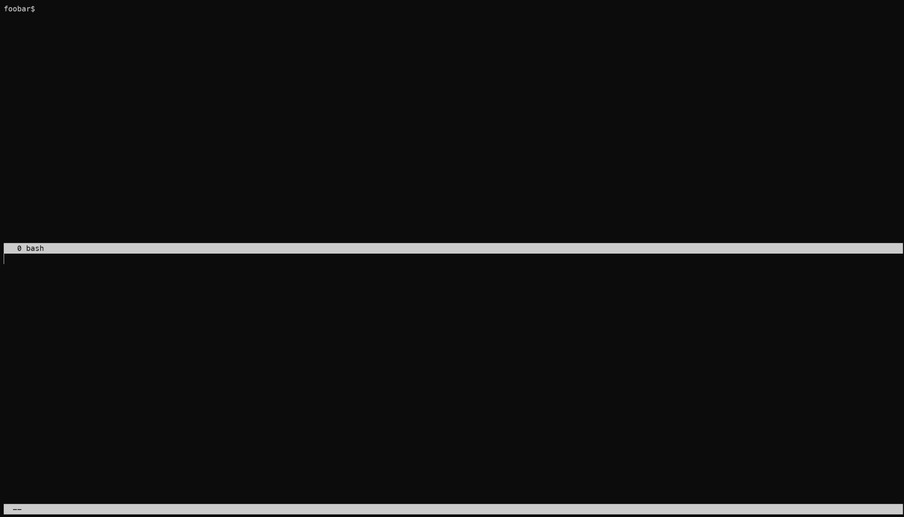

分かりづらいですが、上の画像では分割された画面の下側にフォーカスが移動しています。
また初期状態では下半分にはWindowが割り当てられていない状態となる。

スクリーンコマンドで実行する場合は

`CTRL+A :`でコマンドラインモードに入り　`focus`　で実行。
もしくは`screen -X focus`を実行。

## Region上にWindowを表示

[Screen](https://www.gnu.org/software/screen/manual/screen.html#Screen-Command)

- `CTRL+A c`
- `CTRL+A CTRL+c`
- `Command:screen`

`CTRL+A c` もしくは `CTRL+A CTRC+c`で新しいWindowを生成するとRegionにWindowがアタッチされます。

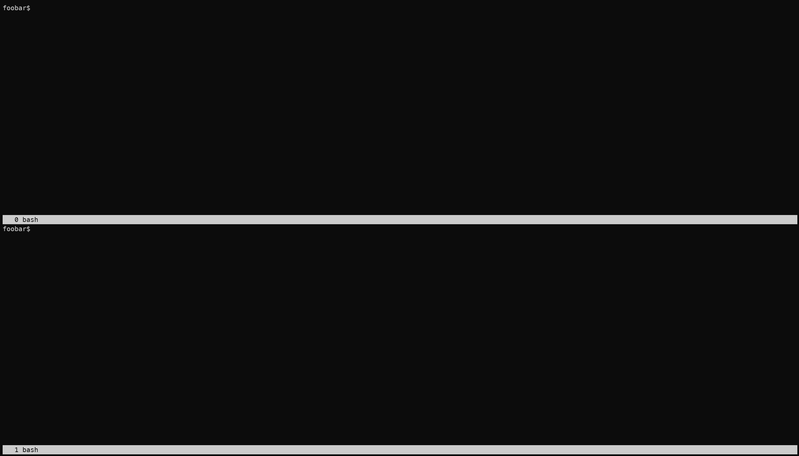

スクリーンコマンドで実行する場合は

`CTRL+A :`でコマンドラインモードに入り　`screen`　で実行。
もしくは`screen -X screen`を実行。

また`CTRL+A "`でWindow listから選択してWindowを選択する事や。
`CTRL+A n`でWindowを表示する事もできます。

## 現在のRegionを閉じる

[Remove](https://www.gnu.org/software/screen/manual/screen.html#Remove)

- `CTRL+A X`
- `Command:remove`

スクリーンセッションに接続している状態で`CTRL+A X`を実行することで現在のRegionを閉じる事が出来ます。

スクリーンコマンドで実行する場合は

`CTRL+A :`でコマンドラインモードに入り　`remove`　で実行。
もしくは`screen -X remove`を実行。

## 現在のRegion以外をすべて閉じる

[Only](https://www.gnu.org/software/screen/manual/screen.html#Only)

- `CTRL+A Q`
- `Command:Only`

スクリーンセッションに接続している状態で`CTRL+A Q`を実行することで現在のRegionを閉じる事が出来ます。

スクリーンコマンドで実行する場合は

`CTRL+A :`でコマンドラインモードに入り　`only`　で実行。
もしくは`screen -X only`を実行。

## Regionのリサイズ

[Resize](https://www.gnu.org/software/screen/manual/screen.html#Resize)

- `screen -X resize 40%`
- `Command:resize`

Regionのリサイズはコマンドから実行します。

`screen -X resize 40%`と実行すれば現在のRegionが全体の40%の大きさになります。

`CTRL+A :`から`resize 40%`と実行もできます。

サイズ指定方法は色々とあるのでマニュアルを参照して下さい。

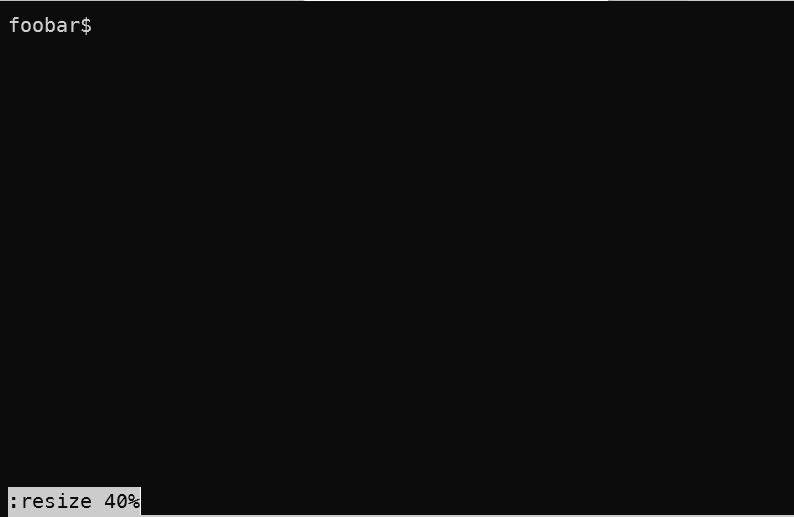

## Window Captionについて

[Caption](https://www.gnu.org/software/screen/manual/screen.html#Caption)

- `Command: caption always|splitonly [string]`
- `Command: caption string [string]`

Regionを分割した際に、Window下部にキャプションが表示されます。

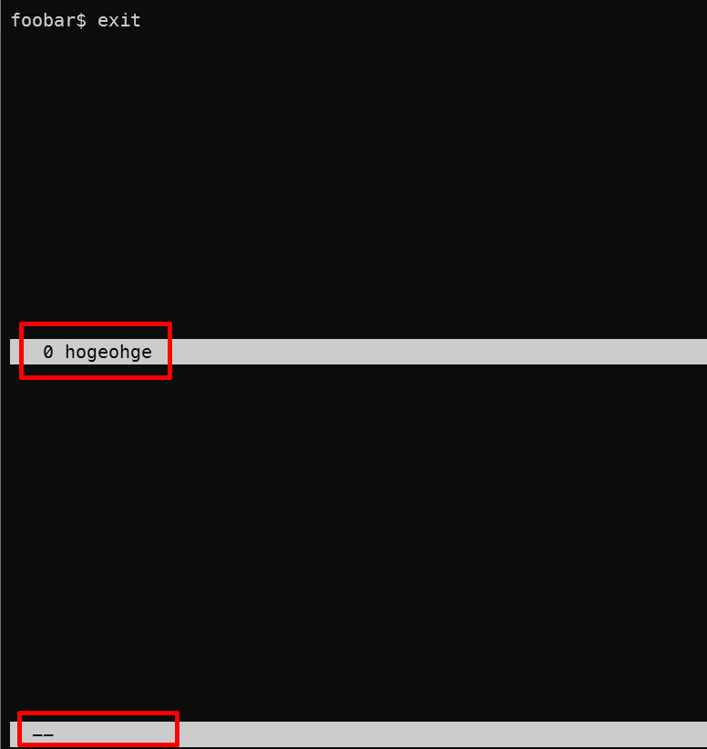

`caption`のデフォルトでは`splitonly`が設定されており画面分割時のみしかキャプションが表示されませんが。
`always`を指定することにより単一ウィンドウの場合でもcaptionを表示する事ができます。

`CTRL+A :`でコマンドラインモードに入り　`caption always`　で実行。
もしくは`screen -X caption always`を実行。

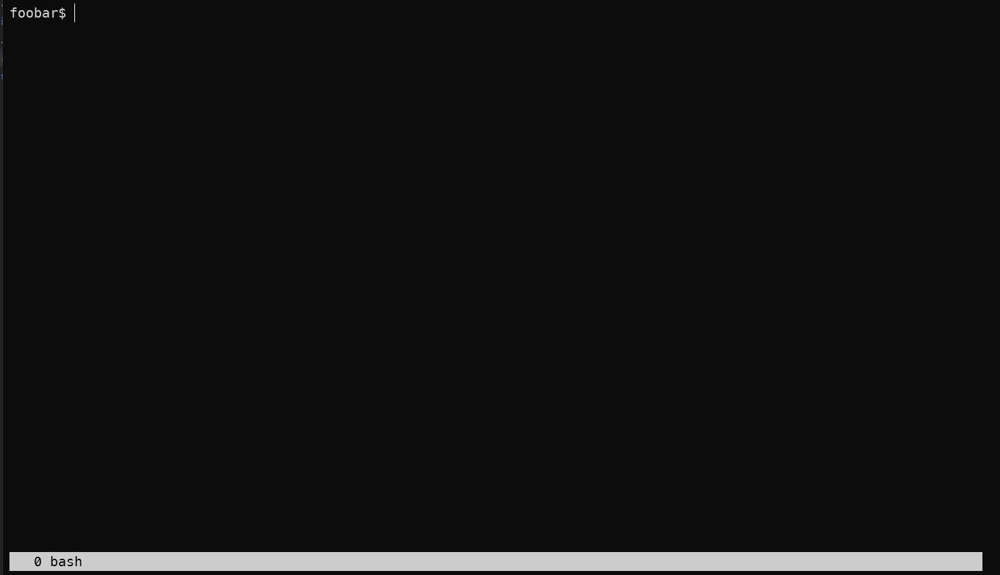

また[string]の部分に書式を設定する事により表示をカスタマイズする事ができます。

書式については下記に記載があります。

[String Escapes](https://www.gnu.org/software/screen/manual/screen.html#String-Escapes)

## .screenrcについて

[Customizing](https://www.gnu.org/software/screen/manual/screen.html#Customization)

`.screenrc`を記述することによりデフォルトのscreen設定を変更する事ができます。
`.screenrc`のデフォルト配置場所としてはuser’s home directory と /usr/local/etc/screenrc.

一例としては`screen`の実行時にスタートアップメッセージが表示されますが、これは`startup_message`で制御されています。

[Startup Message](https://www.gnu.org/software/screen/manual/screen.html#Startup-Message)

.screenrcファイルに`startup_message off`と記載すれば、スクリーンセッション起動時に`startup_message off`の状態で起動されてスタートアップメッセージが表示されません。

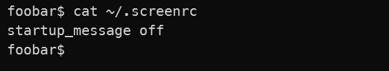

また別の例としては、`caption`を.screenrcに記述することによりカスタマイズしたWindow captionを表示して画面をわかりやすいしたりできます。
`caption`の書式がなかなか難しいですが、下記ブログのように書くこともできるようです。

[GNU screenのcaptionとhardstatusの整理](https://rcmdnk.com/blog/2014/02/18/computer-screen/)

## 総評

今回はざっくりと基本的と思われる使い方を説明してみました。

公式のマニュアルをみるとわかりますが、多岐に渡った機能が提供されている事がわかります。
今回はまったくふれませんでしたが、

- マルチユーザでセッションを共有できる機能。
- コピー＆ペーストの機能。

等々使いこなせば便利であろう機能が色々とあります。

多種多様な機能があるだけに、さわりはじめはかなりとっつきづらい印象がありますが。
公式マニュアルがしっかり書いてあるので、これを読めばなんとかなるという感じ。
